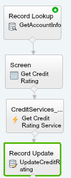
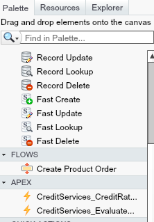
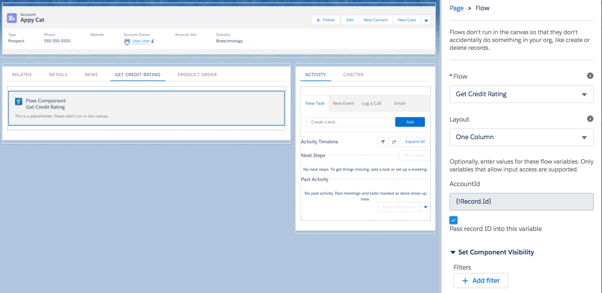

# External Services Demo
This is an example of the Salesforce External Services (Beta) feature.  External Services provides you a mechanism to connect to a service of your choice, invoke methods based on that external source via flow and interact with the data from that service. This is all done with an easy-to-use wizard, no apex required.  An External Service must have a schema defined in either interagent or Swagger/OpenAPI 2.0 formats for it work with the wizard.

## Post Install Step
After pushing the code to your org, ensure that all flows are active.

Then you will need to assign the permission set to the user. 
To do this, run the following command:  
>sfdx force:user:permset:assign -n ExternalServicesDemo -u <TARGETUSERNAME>

Next, create a test account. 
To do this, run the following command: 
>sfdx force:data:tree:import -f Accounts.json -u <TARGETUSERNAME>

If these items are not completed, the flow will not run properly.

## How To Demo
You can demo this by opening an account record, click on the "Get Credit Rating" tab, and navigate through the flow. The flow will display the credit rating from the external service and updates the account record.

## Steps to Recreate in a Live Demo

### Creating Named Credential 
1. Navigate to Setup -> Named Crednetials
2. Click "New Named Credential" button
3. Fill out credential information
    * Label: Test Credential Name
    * Name: Test_Credential_Name
    * URL: URL of Credential
    * Authentication Method
4. Click "Save" button

### Create External Serivce
1. Navigate to Setup -> Integrations (Beta)
2. Click "Register New External Service" button
3. On Register New Step, enter: 
    * Service Name (required)
    * Description
    * Service Schema URL Path (required if not copying json schema)
    * Provide Complete Schema (check box if not providing URL path, then copy json schema into text area)
4. Select Named Credential created from previous step
5. Click Save.

### Build Flow
1. Navigate to Setup -> Flow
2. Click "New Flow" button
3. Drag and drop Flow Elements from the Palette tab to the cavas. Connect the Elements as appropriate. 

   Methods created from External Services will show up under the Apex section in the Palette. 
    

4. Save completed Flow and activate.
5. Embed flow on page using the Flow lightning component.
   

## Resources
Salesforce Documentation related to the components leveraged in this demo.

[Visual Workflow Developer Guide](https://developer.salesforce.com/docs/atlas.en-us.salesforce_vpm_guide.meta/salesforce_vpm_guide/vpm_intro.htm)

[Named Credentials](https://developer.salesforce.com/docs/atlas.en-us.apexcode.meta/apexcode/apex_callouts_named_credentials.htm)

[External Services](https://help.salesforce.com/articleView?id=external_services.htm)

